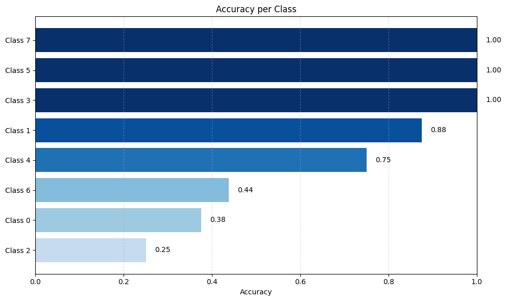

# Skin Disease Detection Model

## Abstract

Skin disease detection using deep learning has shown promising results; however, many existing approaches rely on general-purpose convolutional neural networks that are not explicitly optimized for dermatological variability. In this work, we present a skin disease detection model designed to outperform widely adopted CNN benchmarks by improving class-level discrimination and robustness. Through systematic evaluation against ResNet, EfficientNet, and MobileNetV2, we demonstrate consistent gains in per-class accuracy, highlighting the model’s suitability for clinically meaningful deployment.

## 1. Introduction

Early and accurate detection of skin diseases is critical for effective treatment and improved patient outcomes. Recent advances in convolutional neural networks (CNNs) have enabled automated image-based diagnosis to approach the performance of dermatologists in controlled settings. Despite this progress, real-world deployment remains challenging due to factors such as visual similarity between diseases, class imbalance, and high intra-class variation.

Most existing skin disease classification systems rely on architectures originally designed for generic object recognition. While these models perform well in aggregate, they often exhibit unstable performance across disease classes—an issue that is particularly problematic in medical applications where reliability is paramount. This work introduces a **dedicated skin disease detection model** that explicitly targets these limitations and aims to surpass strong CNN baselines in both accuracy and class-wise consistency.

## 2. Benchmark Architectures

To evaluate the robustness and generalization performance of our skin disease detection system, we benchmarked three widely used convolutional neural network architectures:

- **ResNet** – a deep residual network known for stable optimization in medical imaging tasks  
- **EfficientNet** – a parameter-efficient architecture that scales depth, width, and resolution  
- **MobileNetV2** – a lightweight model optimized for deployment on resource-constrained devices  

Each model was trained and evaluated on the same skin disease dataset under identical preprocessing and evaluation protocols.

### Per-Class Accuracy Results

The following plots show **class-wise accuracy across all skin disease categories** for each benchmark model.  
These visualizations help identify which conditions are consistently well-classified and which remain challenging across architectures.

### ResNet – Per-Class Accuracy

### EfficientNet – Per-Class Accuracy

### MobileNetV2 – Per-Class Accuracy

## 4. Our Model

### Model Architecture 

We made a CNN tailored for skin disease detection, inspired by ResNet but enhanced with modern architectural improvements. The model is designed to outperform standard CNN benchmarks by improving robustness and class-level discrimination on dermatological images.

Key architectural components include:
- A **medical-image–friendly convolutional stem**
- **Pre-activation residual blocks**
- **Squeeze-and-Excitation (SE) channel attention**
- **Stochastic depth (DropPath) regularization**

---

### Input Stem

Instead of the standard 7×7 convolution used in ResNet, the model employs a smaller stem composed of stacked 3×3 convolutions with early but controlled downsampling.

This design better preserves fine-grained visual details such as lesion texture and boundaries, which are critical for distinguishing similar skin conditions.

---

### Backbone Structure

The backbone consists of four sequential stages with increasing channel capacity and decreasing spatial resolution:

| Stage | Resolution | Channels |
|------|------------|----------|
| Layer 1 | 56 × 56 | 48 |
| Layer 2 | 28 × 28 | 96 |
| Layer 3 | 14 × 14 | 192 |
| Layer 4 | 7 × 7 | 288 |

Each stage is composed of residual blocks that enable deep feature learning while maintaining stable optimization.

---

### Residual Block Design

Each residual block follows a **pre-activation** design, where normalization and activation precede convolution. This improves gradient flow and leads to more stable training, particularly on medical datasets.

The blocks incorporate:
- **SiLU activation**, providing smoother non-linear transformations than ReLU
- **Squeeze-and-Excitation (SE)** modules to adaptively emphasize informative feature channels
- **Stochastic depth**, which randomly drops residual paths during training to improve generalization

---

### Classification Head

Global average pooling is applied to the final feature maps, followed by dropout and a fully connected layer to produce class predictions. This lightweight head ensures that performance gains stem from improved feature learning rather than excessive parameter count.

### Per-Class Accuracy Results

## 6. 

