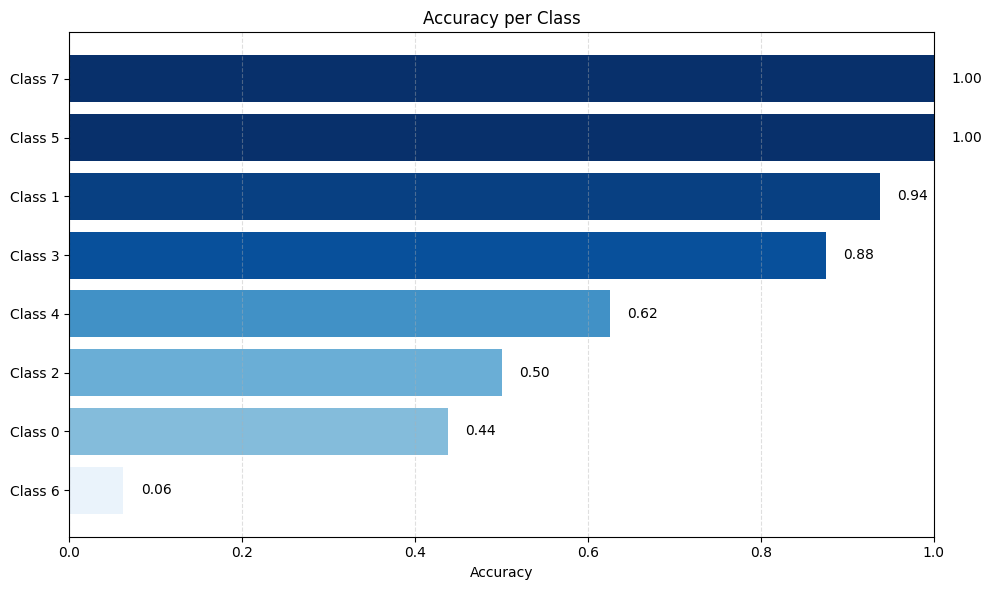
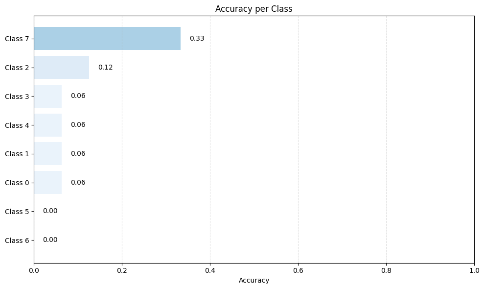
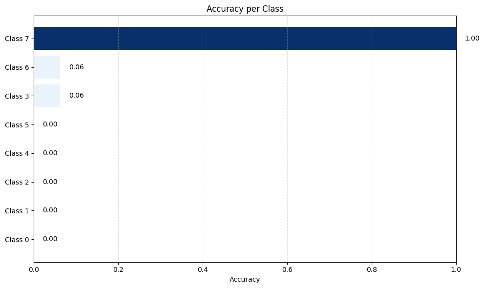

# skin-disease-detection

## Benchmark Models

To evaluate the robustness and generalization performance of our skin disease detection system, we benchmarked three widely used convolutional neural network architectures:

- **ResNet** – a deep residual network known for stable optimization in medical imaging tasks  
- **EfficientNet** – a parameter-efficient architecture that scales depth, width, and resolution  
- **MobileNetV2** – a lightweight model optimized for deployment on resource-constrained devices  

Each model was trained and evaluated on the same skin disease dataset under identical preprocessing and evaluation protocols.

### Per-Class Accuracy Results

The following plots show **class-wise accuracy across all skin disease categories** for each benchmark model.  
These visualizations help identify which conditions are consistently well-classified and which remain challenging across architectures.

### ResNet – Per-Class Accuracy

### EfficientNet – Per-Class Accuracy

### MobileNetV2 – Per-Class Accuracy

### Key Observations
- Deep architectures (ResNet, EfficientNet) generally achieve higher accuracy on visually complex skin conditions.
- MobileNetV2 maintains competitive performance despite significantly lower computational cost.
- Certain classes exhibit consistently lower accuracy across all models, indicating intrinsic visual ambiguity or class imbalance.

These benchmark comparisons provide a comprehensive view of model behavior at the **class level**, which is critical for clinical reliability in skin disease detection systems.
